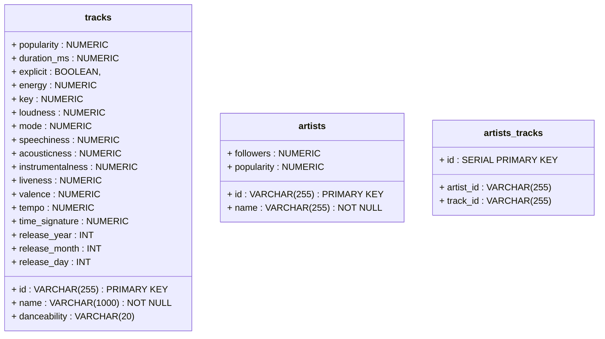

# TeleSoftTask
 Spotify data transformation and analysis task

# How to run solution

1. Download Spotify dataset from Kaggle (Link: https://www.kaggle.com/datasets/yamaerenay/spotify-dataset-19212020-600k-tracks)
2. run CreateDB.sql to create database, tables, and views (example command: psql -U postgres -a -f CreateDB.sql)
3. run DataTransformation.js to transform data and upload it to AWS S3 (example command: node DataTranformation.js)
4. run DataLoading.js to load data from AWS S3 into locally hosted PostgreSQL (example command: node DataLoading.js)

### PostgreSQL Database ER Diagram
 Tables:
  tracks - Track data
  artists - Artist data
  artists_tracks - intermediary table to store artist id and id of the song artist has created

# Technologies used

1. Back-End: NodeJs
2. Data storage: AWS S3
3. Database: PostgreSQL
